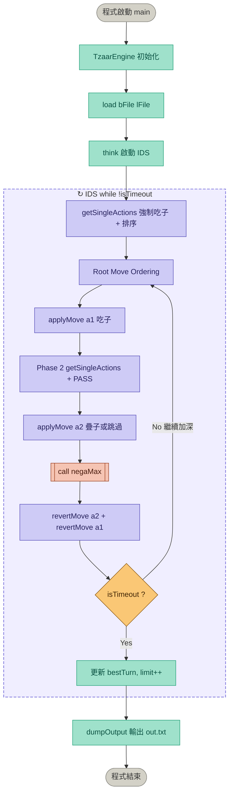
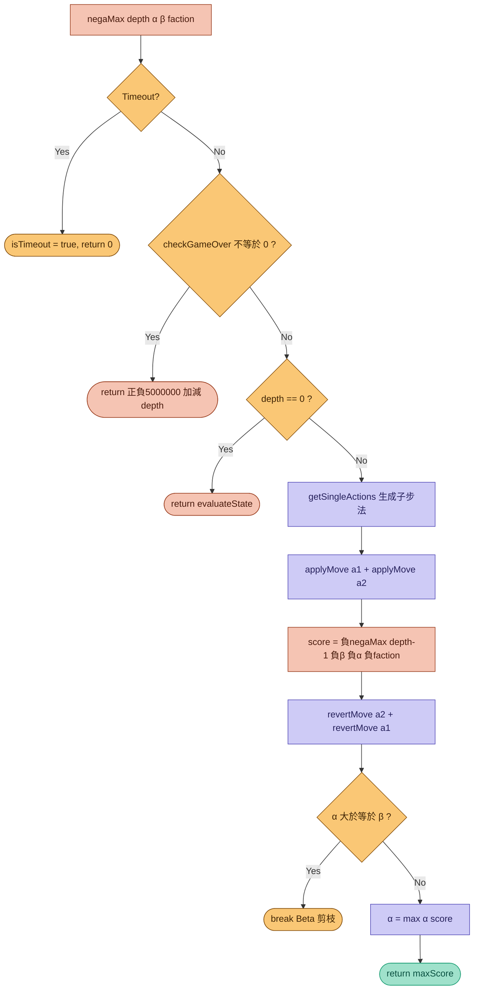
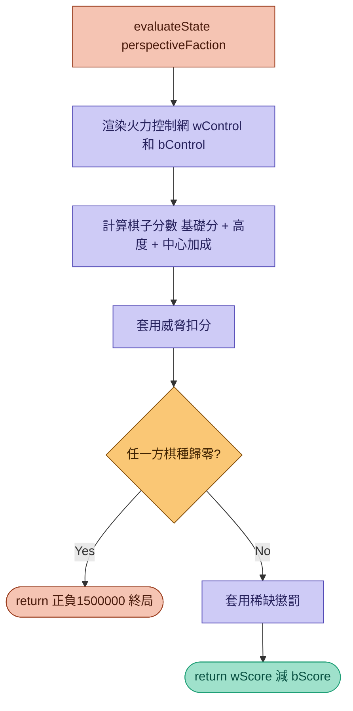

# 1. 程式碼分析

## 全域常數與方向向量

* `GRID_SIZE = 9`：棋盤為 9×9 陣列
* `TIME_LIMIT_SEC = 4.1`：搜尋時間上限為 4.1 秒
* `vecR[6]`, `vecC[6]`：六角形網格的六個方向向量（row 與 column 的偏移量）

```cpp=
const int GRID_SIZE = 9;
const double TIME_LIMIT_SEC = 4.1;

const int vecR[6] = { 0, 1, 1, 0, -1, -1 };
const int vecC[6] = { 1, 1, 0, -1, -1, 0 };
```

---

## struct

### 1. `Action`：定義單步動作
* `type`：動作類型（`'E'` = 吃子, `'S'` = 疊子, `'P'` = 跳過）
* `r1, c1`：來源格座標；`r2, c2`：目標格座標
* `baseScore`：啟發式評分，用於步法排序

```cpp=
struct Action {
    char type;
    int r1, c1, r2, c2;
    int baseScore;
};
```

### 2. `Turn`：定義一回合（包含兩次動作）
* `first`：第一步動作
* `second`：第二步動作
* `turnScore`：該回合總分

```cpp
struct Turn {
    Action first;
    Action second;
    int turnScore;
};
```

---

## class

### 1. `SysTimer`：高精度系統計時器
* `#include <chrono>`
* 定義 `start` 變數的 data type 為 `chrono::high_resolution_clock::time_point`
* `reset()`：紀錄當前時間點
* `elapsed()`：回傳自 `reset()` 起經過的秒數（`double`）

```cpp=
class SysTimer {
    std::chrono::high_resolution_clock::time_point start;
public:
    void reset() { start = std::chrono::high_resolution_clock::now(); }
    double elapsed() { return std::chrono::duration<double>(std::chrono::high_resolution_clock::now() - start).count(); }
};
```

---

### 2. `TzaarEngine`：TZAAR 棋局 AI 引擎主體

#### Private 成員變數

| 變數 | 型別 | 說明 |
|------|------|------|
| `board[9][9]` | `int` | 棋盤上各格的棋子類型（0=空, 1-3=白方, 4-6=黑方, -1=無效格） |
| `towers[9][9]` | `int` | 各格棋塔的高度 |
| `myFaction` | `int` | 本方陣營（1=白方, -1=黑方） |
| `currentRound` | `int` | 當前回合數 |
| `bestTurn` | `Turn` | 迭代加深搜尋中全域最佳回合 |
| `isTimeout` | `bool` | 超時旗標，用於安全中斷遞迴 |

---

#### Private 方法

##### `validPos(int r, int c) → bool`
* 檢查座標 `(r, c)` 是否在合法棋盤範圍內
* 條件：`0 ≤ r, c < 9` 且該格不為無效格（`board[r][c] != -1`）

```cpp
bool validPos(int r, int c) {
    return (r >= 0 && r < GRID_SIZE && c >= 0 && c < GRID_SIZE && board[r][c] != -1);
}
```

---

##### `getFaction(int piece) → int`
* 依棋子編號判斷所屬陣營
  * `1~3` → 白方（回傳 `1`）
  * `4~6` → 黑方（回傳 `-1`）
  * `0` → 空格（回傳 `0`）

```cpp
int getFaction(int piece) {
    if (piece >= 1 && piece <= 3) return 1;
    if (piece >= 4 && piece <= 6) return -1;
    return 0;
}
```

---

##### `applyMove(const Action& a, int& outPiece, int& outHeight)`
* In-place 套用單步動作，並利用 reference 暫存目標格原始棋子與高度（供 backtracking 使用）
* 將棋子從起點 (r1, c1) 搬移到終點 (r2, c2)
* 利用引用參數 outPiece 與 outHeight 將終點原本的狀態「記下來」
* `'E'`（吃子）：目標格繼承來源格高度，來源格清空
* `'S'`（疊子）：目標格高度 += 來源格高度，來源格清空
* `'P'`（跳過）：直接 return，不做任何操作

```cpp
void applyMove(const Action& a, int& outPiece, int& outHeight) {
    if (a.type == 'P') return;
    outPiece = board[a.r2][a.c2];
    outHeight = towers[a.r2][a.c2];
    if (a.type == 'E') towers[a.r2][a.c2] = towers[a.r1][a.c1];
    else if (a.type == 'S') towers[a.r2][a.c2] += towers[a.r1][a.c1];
    board[a.r2][a.c2] = board[a.r1][a.c1];
    board[a.r1][a.c1] = 0;
    towers[a.r1][a.c1] = 0;
}
```

---

##### `revertMove(const Action& a, int origPiece, int origHeight)`
* Backtracking 還原被套用的步法
* `'E'`：來源格高度還原為目標格現值，目標格還原為原始值
* `'S'`：來源格高度 = 目標格現值 - 原始高度（反推），目標格還原

```cpp
void revertMove(const Action& a, int origPiece, int origHeight) {
    if (a.type == 'P') return;
    board[a.r1][a.c1] = board[a.r2][a.c2];
    if (a.type == 'E') towers[a.r1][a.c1] = towers[a.r2][a.c2];
    else if (a.type == 'S') towers[a.r1][a.c1] = towers[a.r2][a.c2] - origHeight;
    board[a.r2][a.c2] = origPiece;
    towers[a.r2][a.c2] = origHeight;
}
```

---

##### `getSingleActions(int faction, bool forceCapture) → vector<Action>`
* 生成當前盤面下 `faction` 的所有合法步法
* 先統計各棋種存活數量（`population[7]`）
* 對每個我方棋子，沿六方向延伸掃描：
  * **吃子（`'E'`）**：遇到敵方且高度不低於對方 → 啟發分 `3000 + 高度×250`；若對方為瀕危棋種（數量=1）額外加 `60000`
  * **疊子（`'S'`）**：遇到同方且非瀕危 → 啟發分 `1500 + 高度×120`（`forceCapture=true` 時不生成）
* 最後依 `baseScore` 降序排列（Move Ordering）

```cpp
vector<Action> getSingleActions(int faction, bool forceCapture) {
    vector<Action> actions;
    int population[7] = { 0 };
    for (int r = 0; r < GRID_SIZE; r++)
        for (int c = 0; c < GRID_SIZE; c++)
            if (board[r][c] > 0) population[board[r][c]]++;
    // ... 掃描六方向，生成合法動作並評分 ...
    sort(actions.begin(), actions.end(), [](const Action& a, const Action& b) {
        return a.baseScore > b.baseScore;
    });
    return actions;
}
```

---

##### `evaluateState(int perspectiveFaction) → int`
* 採用 **Influence Map（勢力圖）** 評估雙方盤面優勢
* 渲染火力控制網：對每個棋子，沿六方向投射，記錄其能威脅的格子最大高度（`wControl`, `bControl`）
* 計算每個棋子基礎分：

| 棋種 | 基礎分 |
|------|--------|
| 1 / 4（TZAAR） | 500 |
| 2 / 5（TZARRA） | 300 |
| 3 / 6（TOTT） | 200 |

* 加成：高度 × 90、中心位置加分（最多 `6×15=90`）
* 威脅扣分：敵方控制高度 > 我方 → -600；相等 → -60
* 稀缺棋種懲罰：數量=1 扣 45000；數量=2 扣 4500
* 終局判定：任一方某棋種歸零 → 輸方 -1,500,000 / 贏方 +1,500,000

```cpp
int evaluateState(int perspectiveFaction) {
    // ... Influence Map 計算 ...
    int INF = 1500000;
    if (!wPop[1] || !wPop[2] || !wPop[3]) return (perspectiveFaction == 1) ? -INF : INF;
    if (!bPop[1] || !bPop[2] || !bPop[3]) return (perspectiveFaction == -1) ? -INF : INF;
    return (perspectiveFaction == 1) ? (wScore - bScore) : (bScore - wScore);
}
```

---

##### `checkGameOver() → int`
* 掃描整個棋盤，確認白方（1,2,3）與黑方（4,5,6）三種棋種是否皆存活
* 回傳值：`0`=未結束, `1`=白方獲勝, `-1`=黑方獲勝

```cpp
int checkGameOver() {
    bool w[4] = { false }, b[4] = { false };
    // ... 掃描棋盤 ...
    bool wAlive = w[1] && w[2] && w[3];
    bool bAlive = b[1] && b[2] && b[3];
    if (!wAlive && bAlive) return -1;
    if (!bAlive && wAlive) return 1;
    return 0;
}
```

---

##### `negaMax(int depth, int alpha, int beta, int turnFaction, SysTimer& tmr) → int`
* 實作 **NegaMax + Alpha-Beta 剪枝** 搜尋演算法
* 搜尋順序：Phase 1（強制吃子） → Phase 2（疊子或跳過 `'P'`）
* 每次遞迴前檢查超時旗標 `isTimeout`，安全終止遞迴
* 終局分數設計：`±5,000,000 ± depth`，確保遠大於盤面評估的 ±1,500,000
* 白方第一回合特殊規則：只執行 Phase 1，Phase 2 省略

```cpp
int negaMax(int depth, int alpha, int beta, int turnFaction, SysTimer& tmr) {
    if (isTimeout || tmr.elapsed() > TIME_LIMIT_SEC) { isTimeout = true; return 0; }
    int gStatus = checkGameOver();
    if (gStatus != 0) return (gStatus == turnFaction) ? (5000000 + depth) : (-5000000 - depth);
    if (depth == 0) return evaluateState(turnFaction);
    // ... Alpha-Beta 剪枝主體 ...
}
```

---

#### Public 方法

##### `TzaarEngine(string role, int round)`：建構子
* `role == "White"` → `myFaction = 1`；否則 `myFaction = -1`
* 初始化 `bestTurn` 的兩個動作皆為 `'P'`（跳過）

```cpp
TzaarEngine(string role, int round) : currentRound(round), isTimeout(false) {
    myFaction = (role == "White") ? 1 : -1;
    bestTurn.first = { 'P', 0,0,0,0,0 };
    bestTurn.second = { 'P', 0,0,0,0,0 };
}
```

---

##### `load(string bFile, string lFile)`
* 讀取棋盤檔案（board file）與塔高檔案（level file）
* 以 `getline` 逐行、再以 `stringstream` 以逗號分隔解析數值，填入 `board` 與 `towers`

```cpp
void load(string bFile, string lFile) {
    ifstream fb(bFile), fl(lFile);
    // ... 逐行讀取並以 ',' 分隔填入二維陣列 ...
}
```

---

##### `think()`：引擎主思考邏輯
* 啟動 **迭代加深搜尋（Iterative Deepening Search, IDS）**
* 每層深度完成後執行 **Root Move Ordering**（歷史最佳步優先）
* 只有在該深度搜尋完整完成（`!isTimeout`）才更新全域 `bestTurn`，避免採用不完整搜尋結果
* 搜尋完畢（超時）後呼叫 `dumpOutput()`

```cpp
void think() {
    SysTimer tmr; tmr.reset();
    int limit = 1;
    while (!isTimeout) {
        // Root Move Ordering：將歷史最佳步移至最前
        // Alpha-Beta 搜尋 Phase 1 + Phase 2
        if (!isTimeout) {
            bestTurn = depthBest;
            limit++;
        }
    }
    dumpOutput();
}
```

---

##### `dumpOutput()`：格式化輸出
* 輸出至 `out.txt`
* 座標轉換：`x = c - 4`, `y = 4 - r`（將陣列索引轉回棋盤座標）
* 格式：`type,sx,sy,ex,ey`，兩行（第一動作、第二動作）

```cpp
void dumpOutput() {
    ofstream out("out.txt");
    auto toXY = [](int r, int c, int& x, int& y) { x = c - 4; y = 4 - r; };
    // 輸出 bestTurn.first 與 bestTurn.second
}
```

---

## `main()` 程式進入點

* 依命令列參數建立引擎並載入棋盤：
  * `argv[1]`：陣營（`"White"` 或 `"Black"`）
  * `argv[2]`：當前回合數
  * `argv[3]`：棋盤檔案路徑
  * `argv[4]`：塔高檔案路徑
  * `argv[5]`：歷史步法檔案（讀取但不使用內容，配合 I/O 規範）
* 呼叫 `ai.think()` 啟動搜尋引擎

```cpp
int main(int argc, char* argv[]) {
    TzaarEngine ai(argv[1], stoi(argv[2]));
    ai.load(argv[3], argv[4]);
    ifstream historyFile(argv[5]);
    if (historyFile.is_open()) { /* 讀取但忽略 */ historyFile.close(); }
    ai.think();
    return 0;
}
```

---

## 演算法架構總覽

```
main()
 └── TzaarEngine::think()                  ← 迭代加深搜尋 (IDS)
      ├── getSingleActions()               ← 生成合法步法 + 啟發式排序
      ├── applyMove() / revertMove()       ← 狀態套用 / 回溯
      └── negaMax(depth, α, β)            ← NegaMax + Alpha-Beta 剪枝
           ├── checkGameOver()            ← 終局偵測
           ├── evaluateState()            ← Influence Map 盤面評估
           └── getSingleActions()         ← 遞迴層步法生成
```
# 2. 程式流程圖

## 主程式流程（main → think → IDS 迴圈）



---

## negaMax 遞迴流程



---

## evaluateState 盤面評估流程



---
# 3. 設計思路

---

## 🧠 策略邏輯 Strategy Logic

### A. 資訊的使用

#### `board.txt`（棋盤棋子資料）
* 各格棋子編號（0 = 空格，1–3 = 白方三種棋種，4–6 = 黑方三種棋種，-1 = 無效格）
* 判斷合法移動範圍（六角形網格的六方向延伸）
* 計算各棋種存活數量（`population[]`），用於偵測瀕危棋種
* 判斷吃子合法性（需我方棋塔高度 ≥ 對方）
* 計算棋子位置中心性（距中心格的曼哈頓距離）

#### `chessLayer.txt`（棋塔高度資料）
* 各格棋塔高度（`towers[][]`）
* 吃子條件判斷：高度比較決定能否吃掉對方
* 疊子防守：決定是否值得犧牲移動力來增加防禦高度
* 評估函數計分：高度越高分數越高（每層 +90 分），同時影響威脅與被威脅的嚴重程度
* 火力控制網（Influence Map）：以高度為強度值，計算雙方對每格的最大威脅值

#### `stepHistory.txt`（歷史步法資料）
* 依題目 I/O 規範開啟並讀取，程式中作為合規性處理（完整讀取但不使用其內容做策略決策）

---

### B. 策略的決定

#### 1. 如何判斷棋局優劣 — Influence Map 評估函數

程式採用**勢力圖（Influence Map）**作為盤面靜態評估的核心，步驟如下：

**Step 1 — 渲染火力控制網**

對每個棋子沿六方向投射，記錄它能攻擊到的第一個敵方格，並以棋塔高度為強度值更新 `wControl[][]` 或 `bControl[][]`。這讓引擎能掌握整張棋盤上雙方各格所承受的最大威脅程度。

**Step 2 — 棋子基礎評分**

| 棋種 | 基礎分 | 理由 |
|------|--------|------|
| TZAAR（1/4） | 500 | 最稀有、最難補充 |
| TZARRA（2/5） | 300 | 中等價值 |
| TOTT（3/6） | 200 | 數量最多、較易補充 |

每個棋子額外獲得：高度加成（×90）+ 中心位置加成（最多 +90）

**Step 3 — 威脅扣分**

* 敵方控制高度 **>** 我方高度：該棋子面臨**致命威脅**，扣 600 分
* 敵方控制高度 **==** 我方高度：**互相牽制**，扣 60 分

**Step 4 — 稀缺棋種懲罰**

* 某棋種數量剩 1 個：扣 45,000 分（極高懲罰，驅使引擎優先保護/消滅瀕危棋種）
* 某棋種數量剩 2 個：扣 4,500 分

**Step 5 — 終局判定**

任一方某棋種歸零 → 直接回傳 ±1,500,000，確保引擎不會忽略終局機會。

---

#### 2. 如何決定出牌 — 雙層步法生成 + 啟發式排序

每回合分兩個 Phase 生成合法步法：

**Phase 1（強制吃子）**

掃描所有我方棋子，沿六方向延伸，遇到可吃的敵方棋子生成 `'E'`（Eat）動作，並計算啟發式分數：

```
基礎分 = 3000 + 目標高度 × 250
若目標為瀕危棋種（數量 = 1）→ 額外 +60,000
```

高分動作排在前面，使 Alpha-Beta 剪枝能更早命中有效分支。

**Phase 2（疊子或跳過）**

生成 `'S'`（Stack）疊子動作及 `'P'`（Pass）跳過選項：

```
疊子分 = 1500 + 來源高度 × 120
```

疊子優先選高塔，以強化防禦價值。

---

#### 3. 獲勝策略規劃 — 迭代加深 + NegaMax + Alpha-Beta

**迭代加深搜尋（IDS）**

從深度 1 開始逐層加深，每層完整搜尋完才更新 `bestTurn`，避免在超時時採用不完整的搜尋結果。時間限制為 4.1 秒，確保在題目規定時間內輸出。

**NegaMax 換手遞迴**

採用 NegaMax 框架，利用零和賽局對稱性，每層遞迴只需最大化自身評分，換手時取負值即可，大幅簡化雙方邏輯的實作。

**Alpha-Beta 剪枝**

維護 α（當前最大保證分）與 β（對手最小保證分），當 `α ≥ β` 時直接剪枝，避免搜尋不可能影響結果的分支。搭配啟發式排序（好棋排前面），使剪枝命中率大幅提升。

**瀕危棋種優先策略**

當某棋種剩下 1 個時，吃掉它可獲得 60,000 的啟發式加分與 45,000 的評估懲罰雙重驅動，引擎會在搜尋樹中強烈傾向執行這類終結性動作。

---

## 🏗️ 策略程式架構 Program Architecture

### 資料結構與模組切割

#### 核心資料結構

| 結構 | 型別 | 用途 |
|------|------|------|
| `board[9][9]` | `int` 二維陣列 | 儲存棋子編號，支援 O(1) 隨機存取 |
| `towers[9][9]` | `int` 二維陣列 | 儲存各格棋塔高度，與 board 一對一對應 |
| `Action` | `struct` | 封裝單步動作（type, r1, c1, r2, c2, baseScore） |
| `Turn` | `struct` | 封裝一回合雙步（first, second, turnScore） |
| `vector<Action>` | STL 動態陣列 | 存放合法步法列表，支援快速排序與迭代 |
| `SysTimer` | `class` | 封裝 `chrono` 高精度計時，統一管理超時邏輯 |

#### 模組切割

```
TzaarEngine
├── 狀態管理層
│   ├── applyMove()      In-place 套用步法，存入原始值供回溯
│   └── revertMove()     Backtracking 精確還原，無需複製整個棋盤
│
├── 步法生成層
│   └── getSingleActions()  合法步法枚舉 + 啟發式評分 + 排序
│
├── 評估層
│   ├── evaluateState()     Influence Map 靜態盤面評估
│   └── checkGameOver()     終局快速偵測
│
├── 搜尋層
│   └── negaMax()           NegaMax + Alpha-Beta 遞迴搜尋
│
└── 控制層
    ├── think()             IDS 迭代加深主迴圈 + Root Move Ordering
    ├── load()              棋盤資料讀取
    └── dumpOutput()        結果格式化輸出
```

---

### 架構優缺點分析

#### ✅ 優點

**1. In-place 狀態更新 + Backtracking**

`applyMove` 與 `revertMove` 採用**原地修改 + Reference 暫存**的設計，不需在每次遞迴時複製整個 9×9 棋盤。相比每層都 `memcpy` 的方案，記憶體用量與 cache 效率都大幅改善，對深度搜尋的效能提升尤為顯著。

**2. 啟發式排序提升剪枝效率**

`getSingleActions` 在生成步法的同時計算 `baseScore` 並排序，讓好棋優先被搜尋。Alpha-Beta 剪枝的效果直接取決於步法排序品質——排序越好，剪枝比例越高，可搜尋的有效深度也越深。

**3. 採用了 NegaMax 演算法**

NegaMax 演算法來取代傳統的 MiniMax，利用了零和遊戲的特性（對手最差的局面等於我方最好的局面），將原本需要分別撰寫的 Max（我方回合）與 Min（敵方回合）兩套對稱邏輯合而為一，大幅縮減了程式碼長度與重複性，也提升了程式的可讀性與維護性。

**4. IDS 保證時間內有可用解**

迭代加深確保引擎在任何時間點被中斷，都已經完整搜尋完上一層深度的最佳解，不會輸出半途而廢的結果。`isTimeout` 旗標讓遞迴能安全且即時地終止，不需額外的例外處理。

**5. 職責分離易於維護**

各功能獨立封裝成方法，例如評估函數 `evaluateState` 完全獨立於搜尋邏輯，可以單獨測試或替換不同的評估策略而不影響搜尋框架。

---

#### ❌ 缺點

**1. 無 Transposition Table（置換表）**

目前每次遞迴都重新計算盤面，相同的局面若經由不同路徑抵達，會被重複搜尋。加入 Zobrist Hashing + 置換表可大幅減少重複計算，顯著提升同等時間內可達到的搜尋深度。

**2. 評估函數計算成本較高**

`evaluateState` 每次需要遍歷整個棋盤兩次（渲染控制網 + 計分），在搜尋樹的葉節點大量呼叫時，累積成本可觀。可透過增量更新（只重新計算受本步影響的格子）來優化。

**3. `vector<Action>` 頻繁動態分配**

每層遞迴都呼叫 `getSingleActions` 並回傳一個 `vector`，涉及堆積記憶體的動態分配與釋放。在深度較深時，這些小型記憶體操作可能成為效能瓶頸，改用預先分配的靜態陣列可改善此問題。

**4. 白方第一回合特殊邏輯散落**

第一回合白棋的特殊規則以 `if (myFaction == 1 && currentRound == 1)` 條件判斷散布於 `think()` 與 `negaMax()` 兩處，增加程式碼的閱讀複雜度，若規則有所變動需同步修改多處。
